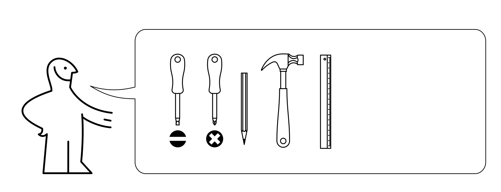
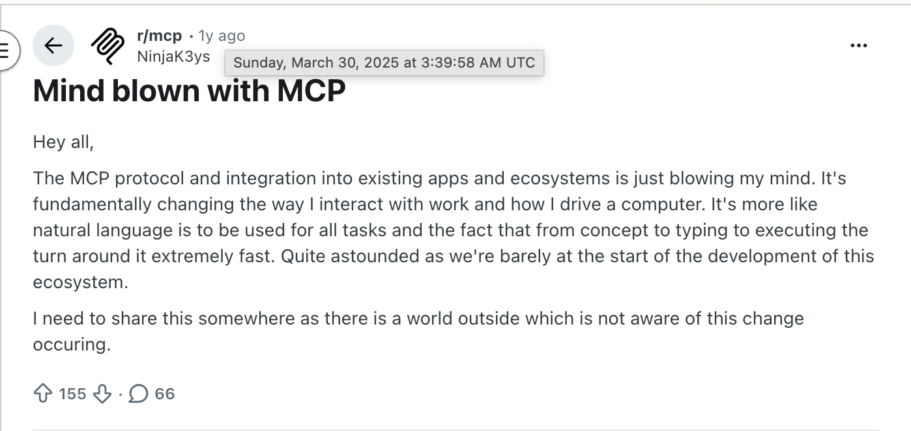
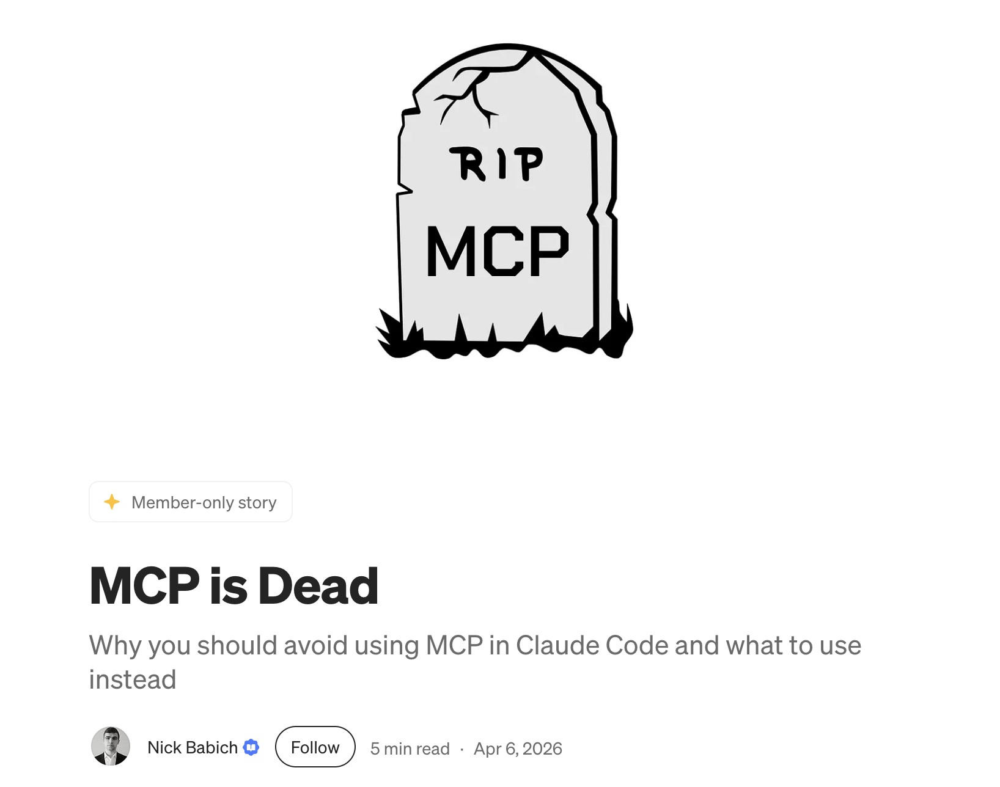

##

<!-- ::: {.notes}
(ask who has used an MCP server before. who has written an MCP server)

I want to start with a story about how I came to understand what MCP was and what it was for. 

For context, I should introduce myself
::: -->

::: {.columns}

:::: {.column width="50%"}


:::

:::: {.column width="50%"}
Hi, I'm Neal 👋

* Open source and data

* Apache Arrow PMC member

* Currently VP Engineering at Posit

* enpiar.com

* arrowrbook.com
::::

:::

::: {.notes}
I've done a few things etc.
Open source, Apache Arrow for many years, was chair of project management committee last year. 
Currently at Posit, and one of the teams I oversee is Posit Connect. (any Connect users out there?)
:::

##


::: {.notes}
Connect is a platform for deploying and sharing custom apps, dashboards, reports, and APIs, things you write in the language or framework of your choice, whether that's Streamlit, Shiny, FastAPI, nodejs, quarto, and so on. 
And, you can host MCP servers on it.
:::

## {background-image="img/kermit-typing.gif"}

::: {.notes}

Last year, we found ourselves getting more and more into using Claude Code. One of the great things about our current moment in the industry is that so many things that may have seemed hard or out of reach before are now available for us to do. It lets us be much more responsive to new ideas and requests--now we can just fire off Claude on a git worktree without having to do all of the context switching to consider it, and many times it just gets it done, or pretty close. 
:::

## {background-image="img/kermit-thinking-cropped.jpg"}

::: {.notes}
So, increasingly, I kept seeing problems and thinking, how can I use Claude to solve it? What else out there have we learned to be hard and painful that maybe isn't anymore?
:::

## {background-image="img/kermit-phone.gif"}

::: {.notes}
Responding to support escalations became one of them. Posit uses Zendesk for support, customers can file tickets there and they get fielded by our support team. When they get a clear bug report, or something that they can't answer on their own, it escalates to the engineers.

I thought, Claude is good at reading the codebase, developing an understanding of how it works, and pinpointing bugs. But when fielding a support escalation, a human engineer still has to read the full Zendesk ticket history, sometimes download and extract server diagnostics that were uploaded, and synthesize that. How can I just plug Zendesk into Claude and let it figure it out?

I want to just take the ticket URL and give it to Claude Code like this:
:::

##

```
 ▐▛███▜▌   Claude Code v2.1.158
▝▜█████▛▘  Opus 4.8 (1M context) · Claude Enterprise
  ▘▘ ▝▝    ~/code

   Opus 4.8 is here! Now defaults to high effort · /effort xhigh for your hardest tasks

❯ please help me with https://posit.zendesk.com/agent/tickets/129426

```

::: {.notes}
However, this doesn't work.
:::

## 

```
 ▐▛███▜▌   Claude Code v2.1.158
▝▜█████▛▘  Opus 4.8 (1M context) · Claude Enterprise
  ▘▘ ▝▝    ~/code

   Opus 4.8 is here! Now defaults to high effort · /effort xhigh for your hardest tasks

❯ please help me with https://posit.zendesk.com/agent/tickets/129426

⏺ I'll help with that Zendesk ticket. Let me fetch its contents.

⏺ Fetch(https://posit.zendesk.com/agent/tickets/129426)
  ⎿  Received 259 bytes (200 OK)

⏺ The ticket is behind Zendesk's authentication, so I can't fetch it directly — WebFetch only works on public URLs, and
  I don't have a Zendesk integration available in this session.

  Could you paste the ticket contents here?


```

:::{.notes}
The first piece is authentication--I can't provide my credentials to connect to the Zendesk API. But even if I could, I would run into other challenges: the Zendesk REST API is not designed for AI agents to make efficient and secure use of it. 
:::

<!-- 
## Problems

* Authentication

* Authorization needs to be restricted

* REST API is too verbose

* Sensitive data

* Distribution

::: {.notes}

* Authentication is needed. Claude can't read my environment variables, and I don't want to paste my API key or password into the context--that's dangerous.
* Authorization needs to be scoped. I don't want Claude to be able to do everything I can do.
* (assume we could solve those) API is too verbose: context pollution from unnecessary fields.
* Sensitive data: there is PII in there. I may not want that pulled into my agent session. I might not be allowed by company policy to use it. There may be regulations that say I can't. I don't really know and *really* don't want to find out.
* (assume we get all of that right!) How do I make this available to my team? They would all benefit from this tool. And then others outside my team, like the support team, who may not live in Claude Code?
::: -->

## MCP is designed to solve this {.center}

### [space]{style="color: white;"}

::: {.notes}
MCP offers a solution to this. 

It provides a way for you to authenticate securely to APIs, without giving your credentials to the agent. 

By writing a custom MCP server, you can control exactly what tools are made available and what capabilities they expose. This improves your agent's performance, and it also allows you to protect against a range of security vulnerabilties.

And by hosting an MCP server, you can easily share it with others. 

So today I'm going to talk about MCP, what it's good for and what it's less suited for, and some best practices from my experience. When it's the right tool for the job, MCP can unlock superpowers for your agentic workflows. And when done well, it can actually improve your security posture, which is especially important for AI agents.

A central point I want to land, and that really underlies everything in the talk:
:::

## You can write and host your own MCP servers {.center}

### [https://github.com/nealrichardson/zendesk-mcp-server]{style="color: white;"}

:::{.notes}
To do exactly what you need. Because code is now cheap. So my talk is going to be oriented about writing your own, not about whether or not you should use an MCP server that someone else provides. Even when someone else's hosted MCP server is available to you, you may have reasons for wanting to customize it, as I will show. And thanks to AI, this is all available to you now.
:::

## You can write and host your own MCP servers {.center}

### https://github.com/nealrichardson/zendesk-mcp-server

:::{.notes}
To do exactly what you need. Because code is now cheap. So my talk is going to be oriented about writing your own, not about whether or not you should use an MCP server that someone else provides. Even when someone else's hosted MCP server is available to you, you may have reasons for wanting to customize it, as I will show. And thanks to AI, this is all available to you now.
:::


## What is MCP? {.center}

::: {.notes}
first want to say what it is not
:::

## {background-image="img/gob.gif"}

<!-- :::{.notes}
* AI

* Vector database/RAG

* Magic

... but you can put any of those behind an MCP server, if you want
::: -->

## MCP is specification for providing tools to LLMs




:::{.notes}
* Tools: functions that LLMs can call, the model "sees" that function exists, with a description telling it what it does, what the inputs are, and what the outputs are.

* MCP defines a standard for servers that host tools, and how to register them in your client, any AI application
:::

## Local vs. Remote MCP

### Local

* Runs on your machine
* `claude mcp add name-here -- uvx --from "git+https://github.com/user/repo"`
* Can access your local file system etc.

## Local vs. Remote MCP

### Local

* Runs on your machine
* `claude mcp add name-here -- uvx --from "git+https://github.com/user/repo"`
* Can access your local file system etc.

### Remote

* Runs somewhere else
* `claude mcp add --transport http name-here https://example.com/mcp`
* **Cannot** access your local file system but can access whatever you give the server

:::{.notes}
For a few reasons, I'm going to focus on remote MCP, and in particular on remote MCP servers that you write to do exactly what you need. I think this is the use case that has the most real value today.
:::

## MCP is an API standard {.center}

:::{.notes}
* Originally created by Anthropic in late 2024, and then put under a consortium under the Linux Foundation

* It's a standard for how to design APIs that AI applications can use

* Remote MCP servers communicate over HTTP, basically JSON RPC with a set of well known endpoints and a schema for how tools are defined. 

* Realizing that MCP was just a convention for how to set up API endpoints helped demystify it for me. As someone who has worked in software and data for many years, I know how to use an HTTP API, I know how to build and serve them too. 
:::

## {background-image="img/unix-system.jpg"}

::: {.notes}
You know what this is too. And your coding agents do too.
:::

## There was a lot of excitement



https://www.reddit.com/r/mcp/comments/1jn3ykp/mind_blown_with_mcp/

:::{.notes}
Then, a backlash
:::

## {background-image="img/distracted-boyfriend.jpg"}

## 



https://uxplanet.org/mcp-is-dead-cf16b667ba6d

::: {.notes}
Like most things, there is truth in both the initial excitement for MCP and the hard backlash against it. There weren't good alternatives to MCP when it came out, so people used it for all kinds of things and in questionable ways that today don't make sense. It's ideal for some use cases, and for others you are better off using a CLI. 

Critiques

* Best tool for the job

* Inherent risks with agentic AI

* Best practices

:::

<!-- ## Security

### Untrusted code

* Arbitrary code execution--problem for local MCP if the command to run it is `npx some-random-github-repo` 

* "tool poisoning": malicious actors putting instructions into tool definition that exfil  -->

## MCP, CLI, or Skill?

* If the agent can do everything with tools it already has (Bash, Fetch, etc.) then a Skill is probably enough

* Otherwise, Skill is complement: we're talking (MCP + Skill) vs. (CLI + Skill)

## (MCP + Skill) vs. (CLI + Skill)

::: {.columns}

:::: {.column width="40%"}

::::

:::: {.column width="60%"}

Critique that MCP takes up too much context: all tool definitions are loaded up front and take up tokens

Claude Code is good with CLIs: why use GitHub's MCP if `gh` is already right there?

Use CLI when:

* CLI already exists, is widely available and in the training data

* Your agent has Bash available to call the CLI
::::
:::

:::{.notes}
CLI not and option if the AI application can't run shell commands
:::

## Security

### Lethal Trifecta

* Access to private data

* Exposure to untrusted content

* Ability to exfiltrate

https://simonwillison.net/2025/Jun/16/the-lethal-trifecta/

:::{.notes}
"If your agent combines these three features, an attacker can easily trick it into accessing your private data and sending it to that attacker."

Opening your agent up to external resources and code creates the opportunity for the lethal trifecta. This is not specific to MCP but there were some very public examples of exploits in the early months of MCP. 

Suppose you're reading GitHub issues on a public repo, whether with GitHub MCP or the `gh` CLI. Someone could write a prompt injection into an issue, and that gives you one of the three of the trifecta. So if your agent has any ability to send data out, some other tool that lets it, you've got the trifecta.

so, how do we handle this? and how do we generally get the best results from using MCP? I've identified some best practices:
:::

## Best practices {.center}

### Brevity is the soul of wit

* Only define the tools you need

* Make responses concise

* Sanitize sensitive data

:::{.notes}
Brevity is the soul of wit (had to get one Hamlet reference in here, given the title)

(read slide)

I want to walk through these using some code examples from the Zendesk MCP I (well, Claude) wrote. Because the best way to get started writing your own MCP server is just:
:::

##

```
 ▐▛███▜▌   Claude Code v2.1.158
▝▜█████▛▘  Opus 4.8 (1M context) · Claude Enterprise
  ▘▘ ▝▝    ~/code

   Opus 4.8 is here! Now defaults to high effort · /effort xhigh for your hardest tasks

❯ please use the fastmcp library to help me start an MCP server for ...

```

:::{.notes}
FastMCP is a great framework for MCP in Python. Though you should be aware:
:::

## MCP libraries

<!-- make this progressive? -->
Official MCP SDK

```python
from mcp.server.fastmcp import FastMCP
```

`fastmcp` library

```python
from fastmcp import FastMCP
```

::: {.notes}
There is an official `mcp` SDK, and then there is the `fastmcp` library. Confusingly, the `mcp` SDK incorporated the v1 of `fastmcp` as a submodule within it, but `fastmcp` the separate project has moved on from there. So you may see a `FastMCP` class in your code and need to be clear about which module it's coming from.

Really, just ask your agent to bootstrap your project. Just watch out in case it gets confused with the different fastmcp versions.

The examples I'm going to reference are in this repo:
:::

##

::: {.columns}
:::: {.column width="25%"}

::::

:::: {.column width="50%" style="text-align: center;"}



[github.com/nealrichardson/zendesk-mcp-server]{style="font-size: .7em;"}

::::

:::: {.column width="15%"}

::::
:::

:::{.notes}
These come from the Zendesk MCP server that I talked about writing at the start. I should note that to get this, I started with a JavaScript project someone else had on GitHub, forked it, and asked Claude to port to Python. And to be honest, I don't write much code by hand these days, so the code in there is all Claude-assisted and may not meet our highest aesthetic, Pythonic standards. In fact, in preparing these slides, I was reading some of this for the first time and simplified a bit for presentation here. But hey it works!

Let's start with a simple tool example. 
:::

##

```python
    @mcp.tool()
    async def get_ticket(id: int) -> str:
        """Get a specific ticket by ID.

        Args:
            id: Ticket ID
        """
        try:
            result = await client.get_ticket(id)
            return json.dumps(result, indent=2)
        except Exception as e:
            return f"Error getting ticket: {e}"
```

:::{.notes}
This is the tool definition for getting the Zendesk ticket. It's just a Python function with decorator that makes it a tool, kinda like how you would set up routes in FastAPI or Flask. And the function itself doesn't do much other than pass the ticket ID along to the REST API and return the resulting JSON

<!-- break here and use code highlighting? -->

Notice how we've encapsulated the auth to Zendesk into this "client" object, which we're managing in the MCP server. You can take your API key and set it in the server, and now you don't have to expose that somehow in your agent session: it just calls `get_ticket` and never sees the API key. 

the example references a `client` object, which is a pretty standard looking REST API client class. It holds your credentials, passes them in the right way to the REST API, and it knows how to handle the usual API responses, etc. The important thing to notice here is that the auth to that API, to Zendesk, does not appear in the MCP tool--it's all handled by the server. You put your API key in an environment variable or secret on the server, and then you don't have to pass that around to anyone that wants to access Zendesk. 

<!-- This was really important in this case because, like many other APIs out there, Zendesk doesn't let you make fine-grained access tokens, so the API key you would use here has full read and write access to everything in Zendesk. I don't want to turn an AI agent, non-deterministic and wacky as they can be, wild on our entire support system. So, back to the previous point, the fact that I can selectively expose the tools I want allows me to limit the security exposure. -->

By wrapping the API like this, and not trying to expose the entire API as MCP tools,we can be selective about the tools we're exposing to the AI agent, which is our first best practice.
:::

## 1. Only define the tools you need

```python
    @mcp.tool()
    async def get_ticket(id: int) -> str:
        """Get a specific ticket by ID.

        Args:
            id: Ticket ID
        """
        try:
            result = await client.get_ticket(id)
            return json.dumps(result, indent=2)
        except Exception as e:
            return f"Error getting ticket: {e}"
```

:::{.notes}
So, right now we only have one tool! that's a lot less than the whole REST API. so a lot less information to confuse your model. So we can selectively include tools that we need, and leave off the things that we don't. 

One reason is for efficiency:

Every tool definition consumes context in your agent. That's tokens. Both money and distraction from what your real question is. 

So, unlike when you're making a REST API to interact with via other software, or a web app, or whatever, you want a small number of tools that do exactly what you want. Any more than that has a cost. We wouldn't want to just give Claude the OpenAPI spec for the Zendesk API and say "figure it out". That's way too many endpoints, too much context consumed. 
:::

##
<!--TODO: include screenshots of Zendesk API docs to show scope of the API -->

:::{.notes}
look how big the full API is. we don't need this for our application
:::

## {background-image="img/zendesk-bulk-delete.png"}

:::{.notes}
Another reason is security: do you really need tools that can write?

Many APIs or services you might want to use with your AI agent don't support fine grained access tokens that would give you granular control over what it can do at that level. So restricting tools by construction at the MCP server level can give you that assurance. (Also, just trying to prompt your agent not to do bad things isn't reliable enough.)

If you do have legitimate reasons to expose tools with write access, make more than one server, or make it configurable and make different deployments, or have some other means of allowing users of your MCP server to select only what they need. 

Ok, next thing to do:
:::

## 2. Make responses concise

```python
    @mcp.tool()
    async def list_ticket_comments(ticket_id: int) -> str:
        """List all comments on a ticket.

        Args:
            ticket_id: Ticket ID to get comments from
        """
        result = await client.list_ticket_comments(ticket_id)

        for comment in result.get("comments", []):
            comment.pop("html_body", None)   # keep plain text only
            comment.pop("body", None)
            comment.pop("metadata", None)    # client info, IP, location
            comment["attachments"] = [
                {"file_name": a["file_name"], "content_url": a["content_url"]}
                for a in comment.get("attachments", [])
            ]

        return json.dumps(result, indent=2)
```

:::{.notes}
Here's a second tool, for the comments on a ticket. All of the back and forth discussion that's happened. Instead of passing the raw API payload straight through, I strip it down to just what matters for the question I'm asking.

(Remember, everything this returns goes straight into the model's context. The raw Zendesk response for a comment is huge: each one carries metadata about whether it came in by email or the web portal, the user agent, sometimes the location of the browser where it was typed, plus full attachment details like thumbnails and malware scans. Useful to some developer somewhere, but it's just noise for triaging a bug. So I drop it--keep the plain text, keep enough of each attachment to fetch it, and throw the rest away.)

Less context means lower cost, and less for the model to get distracted by. This is the kind of shaping you can only do when you write the tool yourself.
:::

## 3. Sanitize sensitive data

`n***@posit.co`

```python
import re


EMAIL_RE = re.compile(r"([\w.+-]+)@([\w.-]+)")

def redact_emails(text: str) -> str:
    # keep the domain, hide the person
    return EMAIL_RE.sub(lambda m: f"{m[1][0]}***@{m[2]}", text)
```

:::{.notes}
Last one, and this ties back to the lethal trifecta--or honestly just good data hygiene.

If there's PII in what I'm pulling in, and I don't need it to answer the question, I prune it or redact it before it ever reaches the agent. Here I'm keeping the domain, so I can still see this came from someone at Posit--maybe I want to look up other tickets from that company--but the individual's identity never leaks into the context, into the logs, into wherever that context ends up next.

I get to decide that, because it's my server and my code.
:::

## [This would still be pretty good as local MCP]{style="color: white;"} {background-image="img/obama-thumbs-up.png"}

:::{.notes}
And note: even just this much, served locally, would solve a lot of what I complained about at the start--auth stays out of the agent, the tool set is limited, the responses are trimmed. We'd be efficient with tokens and reduce our exposure to the lethal trifecta. Distribution's not as great though, everyone needs to run it locally--not bad if I push it to GitHub, but the bigger issue is with Zendesk API access. Everyone will have to manage their own API keys, which my Security team would prefer not having floating out there. 

But it's even better as a remote server deployed somewhere. So we need...
:::

## A place to deploy it

* It's just an HTTP API--host it anywhere you host APIs

* Self-host in Docker, inside your own network

* MCP-aware platforms

* Or whatever cloud platform your company already has

:::{.notes}
Remember, at the root this is just an API over HTTP. You don't technically need anything purpose-built for MCP, though there are some good options. I of course deployed mine on Posit Connect, but there are others, Prefect has one, ...

If you self-host inside your own network, you might not even need to implement authentication--the network is your boundary--and you still get all the custom-tool benefits we just walked through.

An MCP-aware platform can handle a bunch of great things for you:
:::

## What a platform handles for you

* **Authentication**: OAuth 2.1 flow, or an HTTP header--clients like Claude Code know the handshake

* **Access control**: who can use the MCP server

* **Monitoring**: logs, traces, etc.: especially important with AI

* **Other enterprise-y things**: integrations, etc.

:::{.notes}
These are the things you just can't get from a CLI, and the things a hosting platform can give you so you don't have to write them.

The MCP standard defines an OAuth 2.1 flow, so a client like Claude Code knows how to authenticate to a remote server on its own, no fiddling with credentials by hand. fastmcp and other hosts can wire that up for you. On a platform you also get access control and monitoring without thinking about it--which deployment a person is allowed to hit, and a record of what got called.

The tradeoff is just that the more general the platform, the more of these you have to build yourself.
:::

## Distribution is a URL {.center}

```
claude mcp add --transport http zendesk https://example.com/zendesk/mcp
```

:::{.notes}
This is the whole onboarding story for a teammate: one line. No install, no local setup, no API keys to manage. They run it, they hit the OAuth flow on first use, and they're in--with exactly the read-only, trimmed, redacted tools I decided to expose.

It also flips the usual worry about other people's MCP servers into an advantage: because I host it, I push the updates, and everyone is on the fixed version the next time they call it. Compare that to a CLI, where everyone has to download, install, and remember to upgrade.

And the support team that doesn't live in Claude Code? They can point any MCP client at the same URL. 
:::

## MCP!

* MCP is (just) an API standard for AI agents

* Writing and deploying your own remote MCP servers can unlock superpowers for your agentic workflows

* AI brings inherent security risks, but a well designed MCP server can mitigate them

* Limiting the tools you expose and the data in responses improves efficiency _and_ security

* You (or your agent) can easily write custom MCP servers

## Or not MCP?

* CLIs are great: if you're in a coding agent that has `bash` and there is a widely available CLI for your task (like `gh`)

* Skills are great: if you can express what you want the agent to do in plain text (markdown), building on other tools it already has

* Local MCP that you own: if you don't have somewhere secure to deploy a remote MCP server

## Thank you

::: {.columns}

:::: {.column width="50%" style="text-align: center;"}

[These slides](https://enpiar.com/mcp-london-2026/)



::::
:::: {.column width="50%" style="text-align: center;"}
[Zendesk MCP repo](https://github.com/nealrichardson/zendesk-mcp-server)


::::
:::
