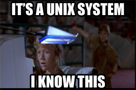
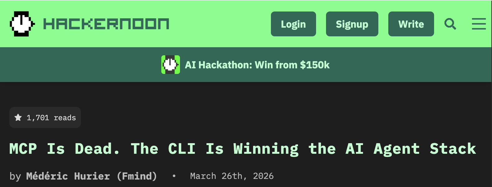

##

::: {.notes}
(ask who has used an MCP server before. who has written an MCP server)

I want to start with a story about how I came to understand what MCP was and what it was for. 

For context, I should introduce myself
:::

##

<!-- Image of me -->

::: {.notes}
I've done a few things etc.
Open source, Apache Arrow for many years, was chair of project management committee last year. 
Currently at Posit, and one of the teams I oversee is Posit Connect. (any Connect users out there?)
:::

##

::: {.notes}
Connect is ...
It is not open source, it is enterprise software that supports you in building things with open source. 

(build to point about thinking about customer support from open-source maintainer lens: I want feedback on the product, and I want you to have a good experience giving it so that you'll come back and do it again. )
(maybe not)
:::

## 

::: {.notes}
Last year, we found ourselves getting more and more into using Claude Code. One of the great things about our current moment in the industry is that, for a well established software project--the Connect codebase is 10 years old--there is such an accumulation of projects and ideas and improvements that we all agree would be great to do, but, ugh, there is so much context to have to load into your brain in order to do it that it just feels overwhelming, so it doesn't get done. But now you can just fire off Claude on a git worktree and many times it just gets it done. 
:::

## 

::: {.notes}
So, increasingly, I kept seeing problems and thinking, how can I use Claude to make it go away?
:::

## 


::: {.notes}
Responding to support escalations became one of them. Posit uses Zendesk for support, customers can file tickets there and they get fielded by our support team. When they get a clear bug report, or something that they can't answer on their own, it escalates to the engineers.

I thought, Claude is good at reading the codebase, developing an understanding of how it works, and pinpointing bugs. But when fielding a support escalation, a human engineer still has to read the full Zendesk ticket history, sometimes download and extract server diagnostics that were uploaded, and synthesize that. How can I just plug Zendesk into Claude and let it figure it out?
:::

## 

::: {.notes}
I want to just take the ticket URL and give it to Claude Code like this:
:::

##

```
 ▐▛███▜▌   Claude Code v2.1.158
▝▜█████▛▘  Opus 4.8 (1M context) · Claude Enterprise
  ▘▘ ▝▝    ~/code

   Opus 4.8 is here! Now defaults to high effort · /effort xhigh for your hardest tasks

❯ please help me with https://posit.zendesk.com/agent/tickets/129426

```

::: {.notes}
However, this doesn't work.
:::

## 

```
 ▐▛███▜▌   Claude Code v2.1.158
▝▜█████▛▘  Opus 4.8 (1M context) · Claude Enterprise
  ▘▘ ▝▝    ~/code

   Opus 4.8 is here! Now defaults to high effort · /effort xhigh for your hardest tasks

❯ please help me with https://posit.zendesk.com/agent/tickets/129426

⏺ I'll help with that Zendesk ticket. Let me fetch its contents.

⏺ Fetch(https://posit.zendesk.com/agent/tickets/129426)
  ⎿  Received 259 bytes (200 OK)

⏺ The ticket is behind Zendesk's authentication, so I can't fetch it directly — WebFetch only works on public URLs, and
  I don't have a Zendesk integration available in this session.

  Could you paste the ticket contents here?
```

::: {.notes}

* Authentication is needed. Claude can't read my environment variables, and I don't want to paste my API key or password into the context--that's dangerous.
* Authorization needs to be scoped. I don't want Claude to be able to do everything I can do.
* (assume we could solve those) API is too verbose: context pollution from unnecessary fields.
* Sensitive data: there is PII in there. I may not want that pulled into my agent session. I might not be allowed by company policy to use it. There may be regulations that say I can't. I don't really know and *really* don't want to find out.
* (assume we get all of that right!) How do I make this available to my team? They would all benefit from this tool. But it sounds like a lot of logic I'll need. 
:::

<!-- 
CC can't read env vars
Don't want your password or api key in the context anyway, that's a security risk
even if it could, I wouldn't want it to have full access to everything I can do, and like many APIs, Zendesk doesn't let you precisely narrow the scope of a key you can grant it.
also the API is verbose and contains a lot of details we don't need. that just pollutes the context and wastes tokens.
and then even if I solve that for myself, I have a distribution problem, I need to make this available to everyone on the team. And potentially outside my team too: other teams, support itself.
 -->

## MCP is designed to solve this

::: {.notes}
MCP offers a solution to this. It provides a way for you to authenticate securely to APIs, without giving your credentials to the agent. By writing a custom MCP server, you can control exactly what tools are made available and what capabilities they expose. And by hosting an MCP server, you can easily share it with others. 

So today I'm going to talk about MCP, what it's good for and what it's less suited for, and some best practices from my experience. When it's the right tool for the job, MCP can unlock superpowers for your agentic workflows. And when done well, it can actually improve your security posture, which is especially important for AI agents.  
:::

## What is MCP?

::: {.notes}
first want to say what it is not
:::

## What MCP is not

<!-- GOB gif? -->

* AI

* Vector database/RAG

* Magic

... but you can put any of those behind an MCP server, if you want

## What is MCP?


A specification for providing tools to LLMs

:::{.notes}
* Originally created by Anthropic in late 2024, and then put under a consortium under the Linux Foundation

* Tools: functions that LLMs can call, the model "sees" that function exists, with a description telling it what it does, what the inputs are, and what the outputs are.

* MCP defines a standard for servers that host tools, and how to register them in your client, any AI application
:::

## Remote vs. Local

* Two kinds of MCP server: local and remote

* Local runs on your computer, remote somewhere else you can reference by URL

* For a few reasons, I'm going to focus only on remote MCP. I think this is the use case that has the most real value today. It also helps with the mental model:

## MCP is an API standard {.center}

:::{.notes}
* It's a standard for how to design APIs that AI applications can use

* Remote MCP servers communicate over HTTP, basically JSON RPC with a set of well known endpoints and a schema for how tools are defined. 

* Local MCP servers don't use HTTP but still are processes running on your machine that receive requests and return responses

* Realizing that MCP was just a convention for how to set up API endpoints helped demystify it for me. As someone who has worked in software and data for many years, I know how to use an HTTP API, I know how to build and serve them too. 
:::

## 




::: {.notes}
You know what this is too. And your coding agents do too. s
:::

## There was a lot of excitement


https://www.reddit.com/r/mcp/comments/1jn3ykp/mind_blown_with_mcp/

## Then, the backlash



https://hackernoon.com/mcp-is-dead-the-cli-is-winning-the-ai-agent-stack

## Then, the backlash


https://uxplanet.org/mcp-is-dead-cf16b667ba6d

## {background-image="img/that-escalated-quickly.jpg"}

::: {.notes}
Like most things, there is truth in both the initial excitement for MCP and the hard backlash against it. There weren't good alternatives to MCP when it came out, so people used it for all kinds of things and in questionable ways that today don't make sense. It's ideal for some use cases, and for others you are better off using a CLI. 

To be specific, remote MCP servers that you write and host yourself. You can manage auth, customize how they respond and what they expose, and even get into fancier enterprise-y things like observability and auditing. 

Critiques

* Inherent risks with agentic AI

* Best tool for the job: MCP, CLI, or Skills

* Best practices

:::

## Security

* Arbitrary code execution--problem for local MCP if the command to run it is `npx some-random-github-repo` (find an example)

* (See other discussion Simon Willison about lethal trifecta and MCP exploits)


## MCP, CLI, or Skill?

* Critique that MCP takes up too much context: all tool definitions are loaded up front and take up tokens

* Claude Code is good with CLIs: why use GitHub's MCP if `gh` is already right there?

* If the agent can do everything with tools it already has (Bash, Fetch, etc.) then a Skill is probably enough

* Otherwise, Skill is complement: we're talking (MCP + Skill) vs. (CLI + Skill)

* Use CLI when:

    * CLI already exists (widely available and in the training data)

    * Your agent has Bash available to call the CLI

:::{.notes}
CLI not and option if the AI application can't run shell commands

Distribution for remote MCP is also easier: single command to add a server by URL, rather than install CLI (and authenticate etc.) out of band
:::

## More things you can do with remote MCP

(that you can't with a CLI)

* Authentication: OAuth 2.1 flow

* Accessing resources not available locally

* Monitoring

:::{.notes}
You (or your agent) could build these into your server, or you could deploy on a platform (like Connect) that gives you these for free.
:::

## Best practices

* Only define the tools you need

* Make responses concise

* Sanitize sensitive data

<!-- first walk through the points I hit at the beginning: auth, manage permissions, trim responses, do exactly what you want 

See also https://chrlschn.dev/blog/2026/03/mcp-is-dead-long-live-mcp/

-->

## Code is cheap

You can write your own easily that does exactly what you need, whether it is exposing 

## What do we need?

* Code

* A place to deploy it

::: {.notes}
Let's start with code. For code, MCP servers are most commonly written in JavaScript or Python. I'm more experienced with Python so that's my choice. 

There is an official `mcp` SDK, and then there is the `fastmcp` library. Confusingly, the `mcp` SDK incorporated the v1 of `fastmcp` as a submodule within it, but `fastmcp` the separate project has moved on from there. So you may see a `FastMCP` class in your code and need to be clear about which module it's coming from.

FastMCP has lots of good examples and syntactic sugar for making it simple to start a project. But really you'll just ask Claude or whatever to do this for you and it will be fine.
:::

```python
from fastmcp import FastMCP
```

```python
from mcp.server.fastmcp import FastMCP
```

## 

Zendesk MCP example: https://github.com/nealrichardson/zendesk-mcp-server

:::{.notes}
Let's start with a simple tool example. This comes from the Zendesk example. This is the tool definition for getting the Zendesk ticket. It's just a Python function with decorator that makes it a tool, kinda like how you would set up routes in FastAPI or Flask. And the function itself doesn't do much other than pass the ticket ID along to the REST API and return the resulting JSON

Why would we do this? Why don't we talk directly to the REST API? 

First is auth: we've encapsulated the auth to Zendesk into this "client" object, which we're managing in the MCP server. You can take your API key and set it in the server, and now you don't have to expose that somehow in your agent session: it just calls `get_ticket` and never sees the API key. 

Second is that we can manage the context: both which resources are available at all, and the contents of the response. We wouldn't want to just give Claude the OpenAPI spec for the Zendesk API and say "figure it out". That's way too many endpoints, too much context consumed. 
:::

```python
    @mcp.tool()
    async def get_ticket(id: int) -> str:
        """Get a specific ticket by ID.

        Args:
            id: Ticket ID
        """
        try:
            result = await client.get_ticket(id)
            return json.dumps(result, indent=2)
        except Exception as e:
            return f"Error getting ticket: {e}"
```

<!-- 


* managing context: right now we only have one tool! that's a lot less than the whole REST API. so a lot less information to confuse your model. So we can selectively include tools that we need, and leave off the things that we don't. 

* auth and security is another big reason, and it relates to that point as well. the example references a `client` object, which is a pretty standard looking REST API client class. It holds your credentials, passes them in the right way to the REST API, and it knows how to handle the usual API responses, etc. The important thing to notice here is that the auth to that API, to Zendesk, does not appear in the MCP tool--it's all handled by the server. You put your API key in an environment variable or secret on the server, and then you don't have to pass that around to anyone that wants to access Zendesk. 

You may be thinking: this could be a risk, you need your server hosted somewhere secure and not open to the internet. hold that thought.

This was really important in this case because, like many other APIs out there, Zendesk doesn't let you make fine-grained access tokens, so the API key you would use here has full read and write access to everything in Zendesk. I don't want to turn an AI agent, non-deterministic and wacky as they can be, wild on our entire support system. So, back to the previous point, the fact that I can selectively expose the tools I want allows me to limit the security exposure.

Next: trimming responses, also sanitizing.

You could serve this locally and it would solve many of the challenges I outlined at the top: you keep auth out of the AI agent, you limit what tools are available, and you can be smart about what you include in the responses so that you both minimize the context you're consuming with the tool responses, and so that you avoid exposing sensitive data. 
 -->

## Deploying MCP servers

<!-- Need to talk somewhere about hosting and deployment, Connect but also others, or just self host in docker or whatever inside your network, maybe that means you don't implement auth, but you can still benefit from the custom tools 

For hosting, you have a few options. I, of course, deployed mine on Posit Connect because (a) it's available to me! and (b) it has some nice features that support MCP. I'll point those out as I go but I promise I'm not going to make this a sales pitch. 

There are other solutions out there for general API hosting, and including some that are tailored to MCP as well. Prefect, which supports the `fastmcp` library, has a hosting service, for example.

You can also deploy on any cloud platform or service that your company has available. Remember, at the root, this is just an API over HTTP, so you don't technically *need* a service that is purpose built for MCP. But going this route, you may have to do a bit more in your code for things like authentication and observability. 

(connect)
(mention oauth flow supported in MCP standard, so clients like Claude Code know how to authenticate to an MCP server.)
(fastmcp, and other hosting products can offer solutions for auth too)

 -->

## Couldn't you just write a CLI instead?

<!-- you could, and sure, go for it!--but:
* Only useful to developers, using an agent that has shell. Can't use in other AI applications (confirm claude desktop can't)
* Requires running code on the user's machine: has some advantages, but may not always be allowed (Windows??) or may not have access to private resources
* Distribution problem: everyone has to download and install and update. Takes what is a security risk when using other people's MCP servers and turns it into an asset (you can push updates eagerly)
* the real win for CLIs are those that are already in the training data for the models. Your CLI isn't, so the agent will have to hit --help on your commands to learn how to use it, and now it's consuming the same context window that your MCP tool definitions are
 -->

 example of `claude mcp add`


## When you should use MCP
<!-- call back to the title? -->

## When you should not

* You're in a coding agent that has `bash` and there is a widely available CLI for your task (like `gh`)

* You can express what you want the agent to do in plain text (markdown), building on other tools it already has

* You don't have somewhere secure to deploy a remote MCP server